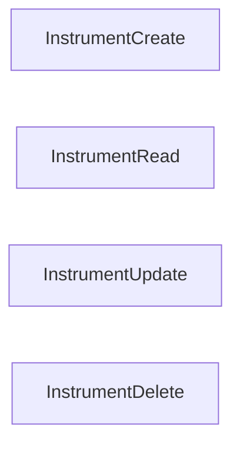

# Instruments Authorization

## CASL ability actions

This is the list of the permissions methods available for Instrument and all their endpoints

### Endpoint Authorization

- InstrumentCreate
- InstrumentRead
- InstrumentUpdate
- InstrumentDelete

#### Priority

#### Authorization table

| HTTP method | Endpoint         | Endpoint Authentication | Anonymous        | Authenticated User | Admin Groups       | Delete Groups      | Notes |
| ----------- | ---------------- | ----------------------- | ---------------- | ------------------ | ------------------ | ------------------ | ----- |
| POST        | instruments      | _InstrumentCreate_      | **no**           | **no**             | _InstrumentCreate_ | **no**             | -     |
| GET         | instruments      | _InstrumentRead_        | _InstrumentRead_ | _InstrumentRead_   | _InstrumentRead_   | **no**             | -     |
| GET         | instruments/_id_ | _InstrumentRead_        | _InstrumentRead_ | _InstrumentRead_   | _InstrumentRead_   | **no**             | -     |
| PATCH       | instruments/_id_ | _InstrumentUpdate_      | **no**           | **no**             | _InstrumentUpdate_ | **no**             | -     |
| DELETE      | instruments/_id_ | _InstrumentDelete_      | **no**           | **no**             | **no**             | _InstrumentDelete_ | -     |
