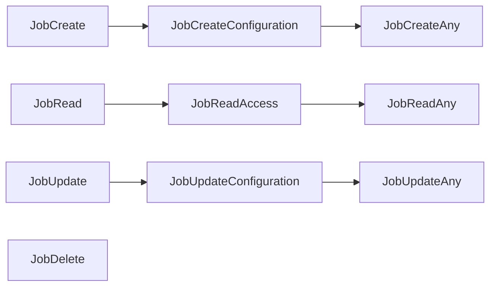
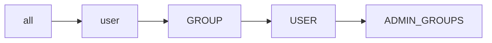

# Jobs Authorization
## CASL ability actions
This is the list of the permission methods available for Jobs and all their endpoints.  
The authorization for jobs is consistently different from all the other endpoints.
Users in `ADMIN_GROUPS` have elevated access and are allowed to do any operation listed bellow.

### Endpoint Authorization
- JobCreate
- JobRead
- JobUpdate
- JobDelete

### (Data) Instance Authorization
- JobCreateConfiguration (The job's create section of the configuration dictates if the user can create the job)
- JobCreateOwner (Users with this privilege can create jobs only for themselves)
- JobCreateAny (Users with this privilege can create jobs for any of the users that are defined in the create section of the job configuration)
- JobReadAccess
- JobReadAny
- JobUpdateConfiguration (The job's update section in configuration dictates if the user can update the job)
- JobUpdateOwner (Users with this privilege can update jobs belonging to themselves)
- JobUpdateAny (Users with this privilege can update any job)

#### Priority

#### Authorization table
| HTTP method | Endpoint | Endpoint Authentication | Anonymous | Authenticated | Create Jobs Groups | Update Jobs Groups | Admin Groups | Delete Groups |
| -------- | ------- | ------- | ------- | ------- | ------- | ------- | ------- | ------- |
| POST | Jobs | _JobCreate_ | _JobCreateConfiguration_ | _JobCreateConfiguration_ | Any _JobsCreateOwner_ | __no__ | Any _JobsCreateAny_ | __no__ |
| GET | Jobs | _JobReadMany_ | __no__ | Has Access _JobReadAccess_ | Has Access _JobReadAccess_ |  __no__  | Any _JobReadAny_ | __no__ |
| GET | Jobs/_jid_ | _JobReadOne_ | __no__ | Has Access _JobReadAccess_ | Has Access _JobReadAccess_ |  __no__  | Any _JobReadAny_ | __no__ |
| PATCH | Jobs/_jid_  | _JobUpdate_ | __no__ | _JobUpdateConfiguration_ | __no__ | Owner _JobUpdateOwner_ | Any _JobUpdateAny_ | __no__ |
| DELETE | Jobs/_jid_ | _JobDelete_ | __no__ | __no__ | __no__ | __no__ | __no__ | __no__ |

#### Job Create Authorization Table
The _JobCreateConfiguration_ authorization permissions are configured directly in the __*create*__ section of the job configuration.  
Any positive match will result in the user acquiring _JobCreate_ endpoint authorization, which applies to the jobs endpoint `POST:Jobs` 
  
| Job Create Authorization | Endpoint Authentication Translation | Endpoint Authentication Description | Instance Authentication Translation | Instance Authentication Description |
| --- | --- | --- | --- | --- |
| _#all_ | _#all_ | any user can access this endpoint, both anonymous and authenticated | _#all_ | Any user can create this instance of the job |
| _#datasetPublic_ | _#all_ | any user can access this endpoint, both anonymous and authenticated | _#datasetPublic_ | the job instance will be created only if all the datasets listed are __public__ |
| _#authenticated_ | _#user_ | any valid users can access the endpoint, independently from their groups | _#user_ | any valid users can create this instance of the job |
| _#datasetAccess_ | _#user_ | any valid user can access this endpoint, independently from their groups | _#datasetAccess_ | the job instance will be created only if the user has access to all the datasets listed |
| _#datasetOwner_ | _#user_ | any valid user can access this endpoint, independently from their groups | _#datasetOwner_ | the job instance will be created only if the user is part of all the datasets' owner group |
| __*@GROUP*__ | __*GROUP*__ | only users that belongs to the specified group can access the endpoint | __*GROUP*__ | the job instance will be created only if the user belongs to the group specified |
| __*USER*__ | __*USER*__ | only the specified user can access the endpoint | __*USER*__ | the job instance can be created only by the user indicated |

__IMPORTANT__: use option _#all_ carefully, as it allows anybody to create a new job. It is mostly used for debuging and testing.

#### Job Update Authorization Table
The _JobUpdateConfiguration_ authorization permissions are configured directly in the __*update*__ section of the job configuration.  
Any positive match will result in the user acquiring  _JobUpdate_ endpoint authorization, which applies to the jobs endpoint `PATCH:Jobs/id` 
  
| Job Update Authorization | Endpoint Authentication Translation | Endpoint Authentication Description | Instance Authentication Translation | Instance Authentication Description |
| --- | --- | --- | --- | --- |
| _#all_ | _#all_ | any user can access this endpoint, both anonymous and authenticated | _#all_ | Any user can update this job instance |
| _#jobOwnerUser_ | _#user_ | authenticated user can access the endpoint | _#jobOwnerUser_ | only the user that is listed in field _ownerUser_ can perform the update |
| _#jobOwnerGroup_ | _#user_ | authenticated user can access the endpoint | _#jobOwnerGroup_ | any user that belongs to the group listed in field _ownerGroup_ can perform the update |
| __*@GROUP*__ | __*GROUP*__ | only users that belong to the specified group can access the endpoint | __*GROUP*__ | the job can be updated only by users who belong to the group specified |
| __*USER*__ | __*USER*__ | only the specified user can access the endpoint | __*USER*__ | the job can be updated only by the user indicated |

__IMPORTANT__: use option _#all_ carefully, as it allows anybody to update the job. It is mostly used for debuging and testing.

#### Job Authorization priority
The endpoint authorization is the most permissive authorization across all the jobs defined.
The priority between job create and update authorization is as follows:

