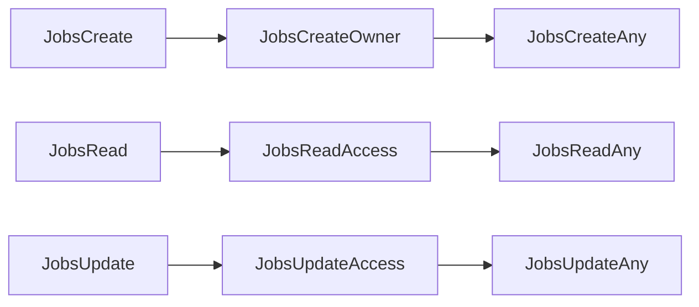

# Jobs Authorization
## CASL ability actions
This is the list of the permissions methods available for Jobs and all their endpoints

### Endpoint Authorization
- JobsCreate
- JobsRead
- JobsUpdate
- JobsDelete

### (Data) Instance Authorization
- JobsCreateOwner
- JobsCreateAny
- JobsReadAccess
- JobsReadAny
- JobsUpdateAccess
- JobsUpdateAny

#### Priority

#### Authorization table
| HTTP method | Endpoint | Endpoint Authentication | Anonymous | Authenticated User | Create Jobs Groups | Update Jobs Groups | Admin Groups | Delete Groups | Notes |
| -------- | ------- | ------- | ------- | ------- | ------- | ------- | ------- | ------- | ------- |
| POST | Jobs | _JobsCreate_ | __no__ | __no__ | Owner _JobsCreateOwner_ | __no__ | Any _JobsCreateAny_ | __no__ |  |
| GET | Jobs | _JobsRead_ | __no__ | Has Access _JobsReadAccess_ | Has Access _JobsReadAccess_ |  __no__  | Any _JobsReadAny_ | __no__ |  |
| GET | Jobs/_jid_ | _JobsRead_ | __no__ | Has Access _JobsReadAccess_ | Has Access _JobsReadAccess_ |  __no__  | Any _JobsReadAny_ | __no__ |  |
| GET | Jobs/fullquery | _JobsRead_ | __no__ | Has Access _JobsReadAccess_ | Has Access _JobsReadAccess_ |  __no__  | Any _JobsReadAny_ | __no__ |  |
| POST | Jobs/statusUpdate | _JobsUpdate_ | __no__ | __no__ | __no__ | Has Access _JobsUpdateAccess_ | Any _JobsUpdateAny_ | __no__ |  |

