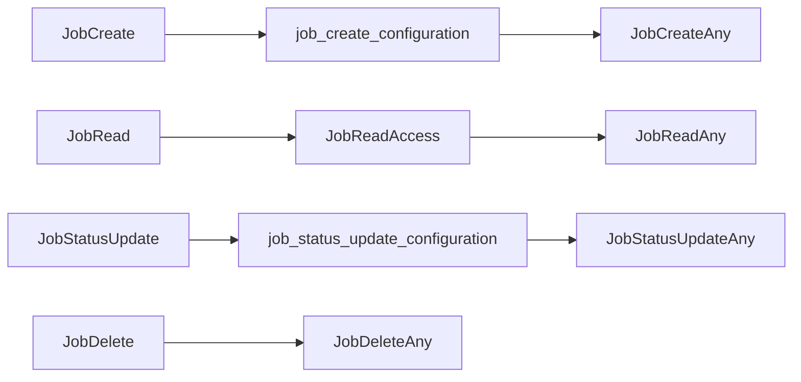
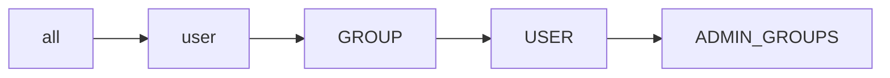

# Jobs Authorization
## CASL ability actions
This is the list of the permissions methods available for Jobs and all their endpoints.  
The authorization for jobs is consistently different from all the other endpoints 

### Endpoint Authorization
- JobCreate
- JobRead
- JobStatusUpdate
- JobDelete

### (Data) Instance Authorization
- *job_create_configuration*: the job create section of the configuration dictates if the user can create the job 
- JobCreateAny: users with this privileges can create jobs for any of the users that are defined in the create section of the job configuration 
- JobReadAccess
- JobReadAny
- *job_satatus_update_configuration*: the job update section in configuration dictates if the user can update the status of the job
- JobStatusUpdateAny: users with this privileges can update the status of any job.
- JobDeleteAny

#### Priority

#### Authorization table
| HTTP method | Endpoint | Endpoint Authentication | Anonymous | Authenticated | Create Jobs Groups | Update Jobs Groups | Admin Groups | Delete Groups | Notes |
| -------- | ------- | ------- | ------- | ------- | ------- | ------- | ------- | ------- | ------- |
| POST | Jobs | _please see job create authorization table_ | _please see job create authorization table_ | _please see job create authorization table_ | Any _JobsCreateOwner_ | __no__ | Any _JobsCreateAny_ | __no__ |  |
| GET | Jobs | _JobRead_ | __no__ | Has Access _JobReadAccess_ | Has Access _JobReadAccess_ |  __no__  | Any _JobReadAny_ | __no__ |  |
| GET | Jobs/_jid_ | _JobRead_ | __no__ | Has Access _JobReadAccess_ | Has Access _JobReadAccess_ |  __no__  | Any _JobReadAny_ | __no__ |  |
| POST | Jobs/statusUpdate | _please see job create authorization table_ | __no__ | _please see job update authorization table_ | __no__ | Owner _JobStatusUpdateOwner_ | Any _JobStatusUpdateAny_ | __no__ |  |
| DELETE | Jobs/_jid_ | _JobDelete_ | __no__ | __no__ | __no__ | __no__ | __no__ | _JobDeleteAny_ | | 

#### Job Create Authorization Table
These authorization permissions are configured directly in the __*create*__ section of the job configuration.  
They apply to the jobs endpoint POST:Jobs  
  
| Job Create Authorization | Endpoint Authentication | Endpoint Authentication Description | Instance Authentication | Instance Authentication Description |
| --- | --- | --- | --- | --- |
| _#all_ | _#all_ | any user can access this endpoint, both anonymous and authenticated | _#all_ | Any user can create this instance of the job |
| _#admin_ | ADMIN_GROUPS | Only users belonging to any group listed in ADMIN_GROUPS will be able to access the endpoint | ADMIN_GROUPS | Only users belonging to any group listed in ADMIN_GROUPS will be able to create this instance of the job |
| _#authenticated_ | _#user_ | any valid users can access the endpoint, independently from their groups | _#user_ | any valid users can cretae this instance of the job |
| _#datasetPublic_ | _#all_ | any user can access this endpoint, both anonymous and and authenticated | _#datasetPublic_ | the job instance will be created only if all the datasets listed are __public__ |
| _#datasetAccess_ | _#user_ | any valid user can access this endpoint, independently from their groups | _#datasetAccess_ | the job instance will be created only if the user has access to all the datasets listed |
| _#datasetOwner_ | _#user_ | any valid user can access this endpoint, independently from their groups | _#datasetOwner_ | the job instance will be created only if the user is part of all the datasets owner group |
| __*GROUP*__ | __*GROUP*__ | only users that belongs to the specified group can access the endpoint | __*GROUP*__ | the job instance will be created only if all the datasets listed belong to the group specified |
| __*USER*__ | __*USER*__ | only the specified user can access the endpoint | _#datasetOwner_ | the job instance will be created only if all the datasets listed are owned by any of the user's groups |

__IMPORTANT__: use option _#all_ carefully, as it allows anybody to create a new job. It is mostly use for debuging and testing

#### Job Status Update Authorization Table
These authorization permissions are configured directly in the __*update*__ section of the job configuration.  
They apply to the jobs endpoint POST:Jobs/statusUpdate  
  
| Job Status Update Authorization | Endpoint Authentication | Endpoint Authentication Description | Instance Authentication | Instance Authentication Description |
| --- | --- | --- | --- | --- |
| _#all_ | _#all_ | any user can access this endpoint, both anonymous and authenticated | _#all_ | Any user can update the status of this job instance |
| _#owner_ | _#user_ | valid user can access the endpoint | _#jobOwner_ | a user that belongs to the group listed as job owner can perform the update |
| _#admin_ | ADMIN_GROUPS | Only users belonging to any group listed in ADMIN_GROUPS will be able to access the endpoint | ADMIN_GROUPS | Only users belonging to any group listed in ADMIN_GROUPS  are able to update the job status |
| __*GROUP*__ | __*GROUP*__ | only users that belongs to the specified group can access the endpoint | __*GROUP*__ | the job status can be updated only by users who belong to the group specified |
| __*USER*__ | __*USER*__ | only the specified user can access the endpoint | __*USER*__ | the job status can be updated only by the user indicated |

__IMPORTANT__: use option _#all_ carefully, as it allows anybody to update the status of the job. It is mostly use for debuging and testing

#### Job Authorization priority
The endpoint authorization is the most permissive authorization across all the jobs defined.
The priority between job create and status update authorization is as follow:

