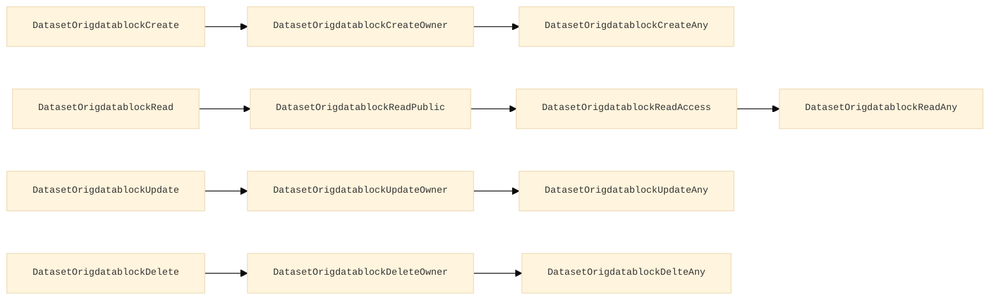

# OrigDatablock Authorization
## CASL ability actions
This is the list of the permissions methods available for origdatablock and all their endpoints
### Endpoint Authorization
- OrigdatablockCreate
- OrigdatablockRead
- OrigdatablockUpdate
- OrigdatablockDelete

### (Data) Instance Authorization
- OrigdatablockCreateOwner
- OrigdatablockCreateAny
- OrigdatablockReadPublic
- OrigdatablockReadAccess
- OrigdatablockReadOwner
- OrigdatablockReadAny
- OrigdatablockUpdateOwner
- OrigdatablockUpdateAny
- OrigdatablockDeleteAny

#### Priority

#### Authorization table
| HTTP method | Endpoint | Endpoint Authentication | Anonymous | Authenticated User | Create Dataset Groups | Create Dataset with Pid Groups | Create Dataset Privileged Groups | Admin Groups | Delete Groups | Notes |
| -------- | ------- | ------- | ------- | ------- | ------- | ------- | ------- | ------- | ------- | ------- |
| POST | origdatablocks | _OrigdatablockCreate_ | __no__ | __no__ | Owner _OrigdatablockCreateOwn_ | Owner _OrigidatablockCreateOwn_ | Any _OrigdatablockCreateAny_ | Any _OrigdatablockCreateAny_ | __no__ |  
| POST | origdatablocks/isValid | _OrigdatablockCreate_ | __no__ | __no__ | Owner _OrigdatablockCreateOwn_ | Owner _OrigdatablockCreateOwn_ | Any _OrigdatablockCreateAny_ | Any _OrigdatablockCreateAny_ | __no__ | 
| GET | origdatablocks | _OrigdatablockRead_ | Public _OrigdatablockReadPublic_ | Has Access _OrigdatablockReadAccess_ | Has Access _OrigdatablockReadAccess_ | Has Access _OrigdatablockReadAccess_ | Has Access _OrigdatablockReadAccess_ | Any _OrigdatablockReadAny_ | __no__ | 
| GET | origdatablocks/_oid_ | _OrigdatablockRead_ | Public _OrigdatablockReadPublic_ | Has Access _OrigdatablockReadAccess_ | Has Access _OrigdatablockReadAccess_ | Has Access _OrigdatablockReadAccess_ | Has Access _OrigdatablockReadAccess_ | Any _OrigdatablockReadAny_ | __no__ | 
| GET | origdatablocks/fullquery | _OrigdatablockRead_ | Public _OrigdatablockReadPublic_ | Has Access _OrigdatablockReadAccess_ | Has Access _OrigdatablockReadAccess_ | Has Access _OrigdatablockReadAccess_ | Has Access _OrigdatablockReadAccess_ | Any _OrigdatablockReadAny_ | __no__ | 
| GET | origdatablocks/fullquery/files | _OrigdatablockRead_ | Public _OrigdatablockReadPublic_ | Has Access _OrigdatablockReadAccess_ | Has Access _OrigdatablockReadAccess_ | Has Access _OrigdatablockReadAccess_ | Has Access _OrigdatablockReadAccess_ | Any _OrigdatablockReadAny_ | __no__ | 
| GET | origdatablocks/fullfacet | _OrigdatablockRead_ | Public _OrigdatablockReadPublic_ | Has Access _OrigdatablockReadAccess_ | Has Access _OrigdatablockReadAccess_ | Has Access _OrigdatablockReadAccess_ | Has Access _OrigdatablockReadAccess_ | Any _OrigdatablockReadAny_ | __no__ | 
| PATCH | origdatablocks/_oid_ | _OrigdatablockUpdate_ | __no__ | __no__ | Owner _OrigdatablockUpdateOwner_ | Owner _OrigdatablockUpdateOwner_ | Owner _OrigdatablockUpdateOwner_ | Any _OrigdatablockUpdateAny_ | __no__ | 
| DELETE | origdatablocks/_oid_ | _OrigdatablockDelete_ | __no__ | __no__ | __no__ |  __no__ | __no__ |  __no__ | Any _OrigdatablockDeleteAny_ | 

