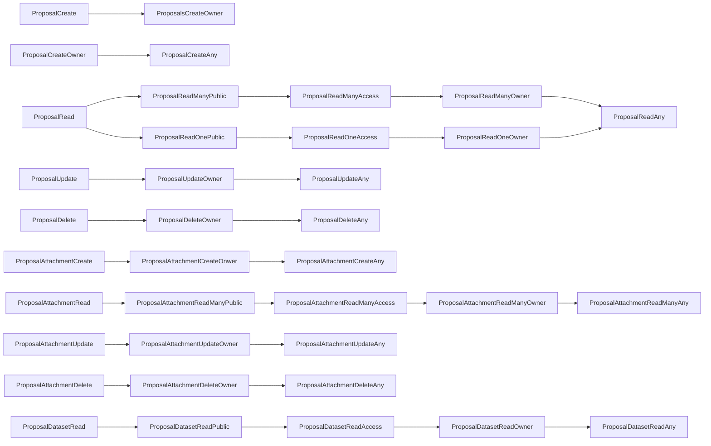

# Proposals Authorization
## CASL ability actions
This is the list of the permissions methods available for Proposals and all their endpoints

### Endpoint Authorization
- ProposalCreate
- ProposalRead
- ProposalUpdate
- ProposalDelete
- ProposalAttachmentCreate
- ProposalAttachmentRead
- ProposalAttachmentUpdate
- ProposalAttachmentDelete
- ProposalDatasetRead

### (Data) Instance Authorization
- ProposalCreateOwner
- ProposalCreateAny
- ProposalReadManyPublic
- ProposalReadManyAccess
- ProposalReadManyOwner
- ProposalReadOnePublic
- ProposalReadOneAccess
- ProposalReadOneOwner
- ProposalReadAny
- ProposalUpdateOwner
- ProposalUpdateAny
- ProposalDeleteOwner
- ProposalDeleteAny
- ProposalAttachmentCreateOnwer
- ProposalAttachmentCreateAny
- ProposalAttachmentReadManyPublic
- ProposalAttachmentReadManyAccess
- ProposalAttachmentReadManyOwner
- ProposalAttachmentReadManyAny
- ProposalAttachmentUpdateOwner
- ProposalAttachmentUpdateAny
- ProposalAttachmentDeleteOwner
- ProposalAttachmentDeleteAny
- ProposalDatasetReadPublic
- ProposalDatasetReadAccess
- ProposalDatasetReadOwner
- ProposalDatasetReadAny

#### Priority

#### Authorization table
| HTTP method | Endpoint | Endpoint Authentication | Anonymous | Authenticated User | Proposals Groups | Admin Groups | Delete Groups | Notes |
| -------- | ------- | ------- | ------- | ------- | ------- | ------- | ------- | ------- | 
| POST | Proposals | _ProposalCreate_ | __no__ | __no__ | Any _ProposalCreateAny_ | Any _ProposalCreateAny_ | __no__ |  |
| GET | Proposals | _ProposalRead_ | Public _ProposalReadManyPublic_ | Has Access _ProposalReadManyAccess_ | Has Access _ProposalReadManyAccess_ | Any _ProposalReadAny_ |  __no__  |  |
| GET | Proposals/fullquery | _ProposalRead_ | Public _ProposalReadManyPublic_ | Has Access _ProposalReadManyAccess_ | Has Access _ProposalReadManyAccess_ | Any _ProposalReadAny_ |  __no__  |  |
| GET | Proposals/fullfacet | _ProposalRead_ | Public _ProposalReadManyPublic_ | Has Access _ProposalReadManyAccess_ | Has Access _ProposalReadManyAccess_ | Any _ProposalReadAny_ |  __no__  |  |
| GET | Proposals/_pid_ | _ProposalRead_ | Public _ProposalReadOnePublic_ | Has Access _ProposalReadOneAccess_ | Has Access _ProposalReadOneAccess_ | Any _ProposalReadAny_ |  __no__  |  |
| GET | Proposals/fullquery | _ProposalRead_ | Public _ProposalReadOnePublic_ | Has Access _ProposalReadOneAccess_ | Has Access _ProposalReadOneAccess_ | Any _ProposalReadAny_ |  __no__  |  |
| PATCH | Proposals/_pid_ | _ProposalUpdate_ | __no__ | __no__ | Owner _ProposalUpdateOwn_ | Any _ProposalUpdateAny_ | __no__ | |
| DELETE | Proposals/_pid_ | _ProposalDelete_ | __no__ | __no__ | __no__ | __no__ | Any _ProposalDeleteAny_ |  |
|||||
| POST | Proposals/_pid_/attachements | _ProposalAttachementCreate_ | __no__ | __no__ | Any _ProposalAttachmentCreateAny_ | Any _ProposalAttachmentCreateAny_ | __no__ |  |
| GET | Proposals/_pid_/attachements | _ProposalAttachmentRead_ | Public _ProposalAttachmentReadManyPublic_ | Has Access _ProposalAttachmentReadManyAccess_ | Has Access _ProposalAttachmentReadManyAccess_ | Any _ProposalAttachmentReadManyAny_ | __no__ | |
| PATCH | Proposals/_pid_/attachments/_aid_ | _ProposalAttachmentUpdate_ | __no__ | __no__ | Owner _ProposalAttachmentUpdateOwner_ | Any _ProposalAttachmentUpdateAny_ | __no__ | |
| DELETE | Proposals/_pid_/attachment/_aid_ | _ProposalAttachmentDelete_ | __no__ | __no__ | Onwer _ProposalAttachmentDeleteOwner_ | Any _ProposalAttachmentDeleteAny_ | __no__ | |
|||||
| GET | Proposals/_pid_/datasets | _ProposalDatasetRead_ | Public _ProposalDatasetReadOnePublic_ | Has Access _ProposalDatasetReadOneAccess_ | Has Access _ProposalDatasetReadOneAccess_ | Any _ProposalDatasetReadOneAny_ | __no__ | |
