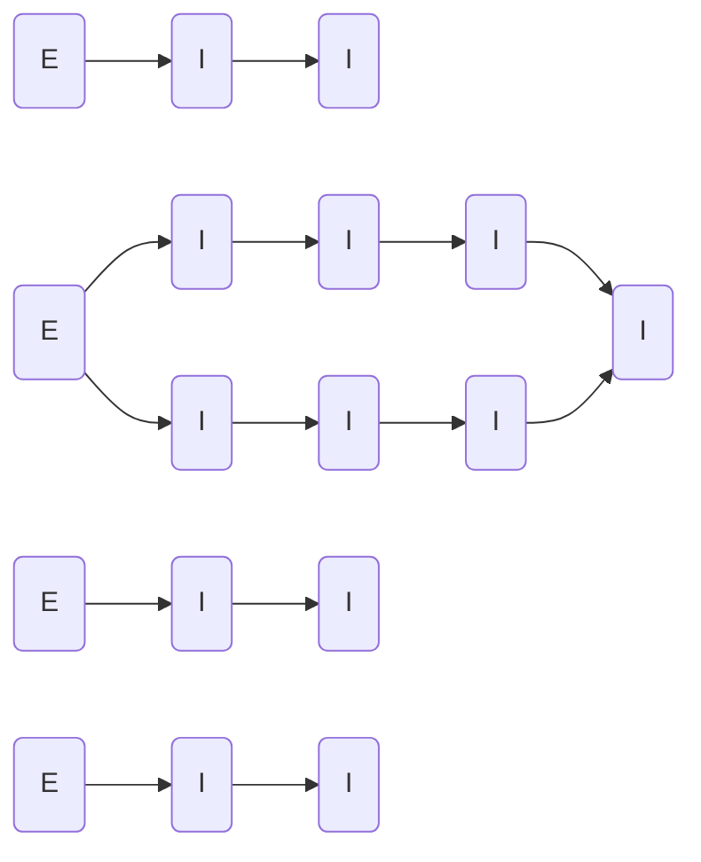

# Proposals Authorization
## CASL ability actions
This is the list of the permissions methods available for Proposals and all their endpoints

### Endpoint Authorization
- ProposalsCreate
- ProposalsRead
- ProposalsUpdate
- ProposalsDelete

### (Data) Instance Authorization
- ProposalsCreateOwner
- ProposalsCreateAny
- ProposalsReadManyPublic
- ProposalsReadManyAccess
- ProposalsReadManyOwner
- ProposalsReadOnePublic
- ProposalsReadOneAccess
- ProposalsReadOneOwner
- ProposalsReadAny
- ProposalsUpdateOwner
- ProposalsUpdateAny
- ProposalsDeleteOwner
- ProposalsDeleteAny

#### Priority

#### Authorization table
| HTTP method | Endpoint | Endpoint Authentication | Anonymous | Authenticated User | Proposals Groups | Admin Groups | Delete Groups | Notes |
| -------- | ------- | ------- | ------- | ------- | ------- | ------- | ------- | ------- | 
| POST | Proposals | _ProposalsCreate_ | __no__ | __no__ | Any _ProposalsCreateAny_ | Any _ProposalsCreateAny_ | __no__ |  |
| GET | Proposals | _ProposalsRead_ | Public _ProposalsReadManyPublic_ | Has  Access _ProposalsReadManyAccess_ | Has Access _ProposalsReadManyAccess_ | Any _ProposalsReadAny_ |  __no__  |  |
| GET | Proposals/_pid_ | _ProposalsRead_ | Public _ProposalsReadOnePublic_ | Has Access _ProposalsReadOneAccess_ | Has Access _ProposalsReadOneAccess_ | Any _ProposalsReadAny_ |  __no__  |  |
| GET | Proposals/fullquery | _ProposalsRead_ | Public _ProposalsReadOnePublic_ | Has Access _ProposalsReadOneAccess_ | Has Access _ProposalsReadOneAccess_ | Any _ProposalsReadAny_ |  __no__  |  |
| POST | Proposals/_pid_ | _ProposalsUpdate_ | __no__ | __no__ | Owner _ProposalsUpdateOwn_ | Any _ProposalsUpdateAny_ | __no__ | |
| DELETE | Proposals/_pid_ | _ProposalsDelete_ | __no__ | __no__ | __no__ | Any _ProposalsDeleteAny_ | __no__ |  |

