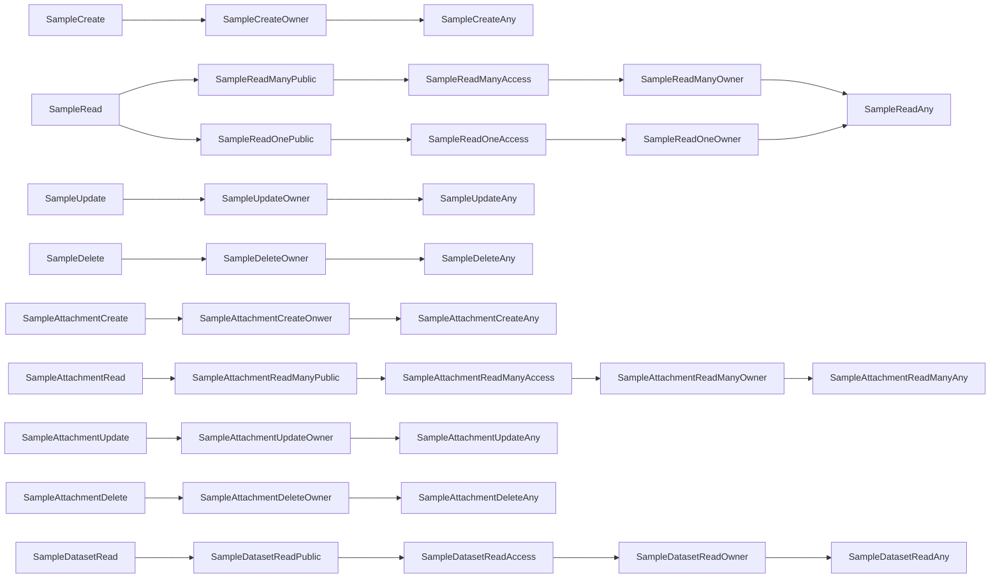

# Samples Authorization
## CASL ability actions
This is the list of the permissions methods available for Samples and all their endpoints

### Endpoint Authorization
- SampleCreate
- SampleRead
- SampleUpdate
- SampleDelete
- SampleAttachmentCreate
- SampleAttachmentRead
- SampleAttachmentUpdate
- SampleAttachmentDelete
- SampleDatasetRead

### (Data) Instance Authorization
- SampleCreateOwner
- SampleCreateAny
- SampleReadManyPublic
- SampleReadManyAccess
- SampleReadManyOwner
- SampleReadOnePublic
- SampleReadOneAccess
- SampleReadOneOwner
- SampleReadAny
- SampleUpdateOwner
- SampleUpdateAny
- SampleDeleteOwner
- SampleDeleteAny
- SampleAttachmentCreateOnwer
- SampleAttachmentCreateAny
- SampleAttachmentReadManyPublic
- SampleAttachmentReadManyAccess
- SampleAttachmentReadManyOwner
- SampleAttachmentReadManyAny
- SampleAttachmentUpdateOwner
- SampleAttachmentUpdateAny
- SampleAttachmentDeleteOwner
- SampleAttachmentDeleteAny
- SampleDatasetReadPublic
- SampleDatasetReadAccess
- SampleDatasetReadOwner
- SampleDatasetReadAny

#### Priority

#### Authorization table
| HTTP method | Endpoint | Endpoint Authentication | Anonymous | Authenticated User | Sample Groups | Admin Groups | Delete Groups | Notes |
| -------- | ------- | ------- | ------- | ------- | ------- | ------- | ------- | ------- | 
| POST | Samples | _SampleCreate_ | __no__ | __no__ | Any _SampleCreateAny_ | Any _SampleCreateAny_ | __no__ |  |
| GET | Samples | _SampleRead_ | Public _SampleReadManyPublic_ | Has Access _SampleReadManyAccess_ | Has Access _SampleReadManyAccess_ | Any _SampleReadAny_ |  __no__  |  |
| GET | Samples/fullquery | _SampleRead_ | Public _SampleReadManyPublic_ | Has Access _SampleReadManyAccess_ | Has Access _SampleReadManyAccess_ | Any _SampleReadAny_ |  __no__  |  |
| GET | Samples/fullfacet | _SampleRead_ | Public _SampleReadManyPublic_ | Has Access _SampleReadManyAccess_ | Has Access _SampleReadManyAccess_ | Any _SampleReadAny_ |  __no__  |  |
| GET | Samples/_pid_ | _SampleRead_ | Public _SampleReadOnePublic_ | Has Access _SampleReadOneAccess_ | Has Access _SampleReadOneAccess_ | Any _SampleReadAny_ |  __no__  |  |
| GET | Samples/fullquery | _SampleRead_ | Public _SampleReadOnePublic_ | Has Access _SampleReadOneAccess_ | Has Access _SampleReadOneAccess_ | Any _SampleReadAny_ |  __no__  |  |
| PATCH | Samples/_pid_ | _SampleUpdate_ | __no__ | __no__ | Owner _SampleUpdateOwn_ | Any _SampleUpdateAny_ | __no__ | |
| DELETE | Samples/_pid_ | _SampleDelete_ | __no__ | __no__ | __no__ | __no__ | Any _SampleDeleteAny_ |  |
|||||
| POST | Samples/_pid_/attachements | _SampleAttachementCreate_ | __no__ | __no__ | Any _SampleAttachmentCreateAny_ | Any _SampleAttachmentCreateAny_ | __no__ |  |
| GET | Samples/_pid_/attachements | _SampleAttachmentRead_ | Public _SampleAttachmentReadManyPublic_ | Has Access _SampleAttachmentReadManyAccess_ | Has Access _SampleAttachmentReadManyAccess_ | Any _SampleAttachmentReadManyAny_ | __no__ | |
| PATCH | Samples/_pid_/attachments/_aid_ | _SampleAttachmentUpdate_ | __no__ | __no__ | Owner _SampleAttachmentUpdateOwner_ | Any _SampleAttachmentUpdateAny_ | __no__ | |
| DELETE | Samples/_pid_/attachment/_aid_ | _SampleAttachmentDelete_ | __no__ | __no__ | Onwer _SampleAttachmentDeleteOwner_ | Any _SampleAttachmentDeleteAny_ | __no__ | |
|||||
| GET | Samples/_pid_/datasets | _SampleDatasetRead_ | Public _SampleDatasetReadOnePublic_ | Has Access _SampleDatasetReadOneAccess_ | Has Access _SampleDatasetReadOneAccess_ | Any _SampleDatasetReadOneAny_ | __no__ | |
