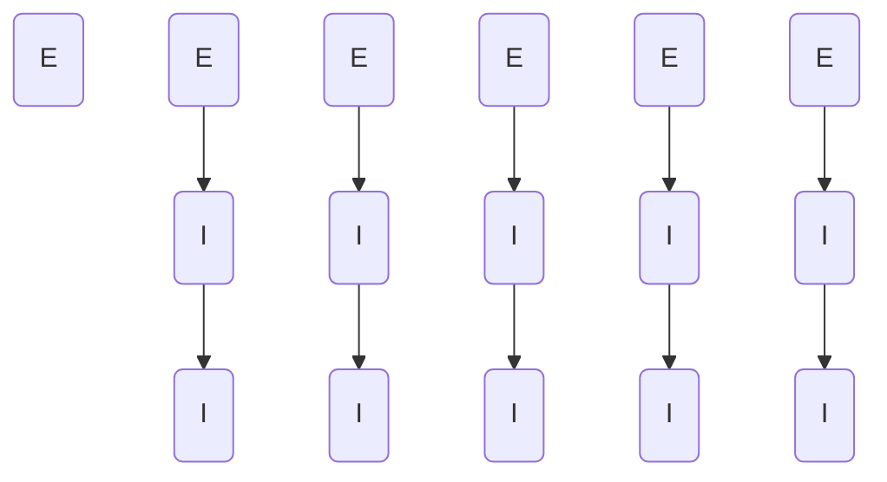

# Users Authorization
## CASL ability actions
This is the list of the permissions methods available for datasets and all their endpoints
##### Endpoint authorization
- UserLogin
- UserRead
- UserCreate
- UserUpdate
- UserPassword
- UserDelete

##### Instance authorization
- UserReadOwn
- UserReadAny
- UserCreateOwn
- UserCreateAny
- UserUpdateOwn
- UserUpdateAny
- UserPasswordOwn
- UserPasswordAny
- UserDeleteAny

#### Priority

#### Authorization table:
| HTTP method | Endpoint | Endpoint Authorization | Anonymous | Authenticated User | User Privileged Groups | Admin Groups | User Delete Groups |  
| ----------- | -------- | --------- | ------------------ | ---------------------- | ------------ |  ------------- | ------------- | 
| POST | Users/jwt | _UserRead_ | __no__ | Own _UserReadOwn_ | __no__ | __no__ | __no__ |
| POST | Users/login | _UserLogin_ | __no__ | __no__ | __no__ | __no__ | __no__ |
| GET | Users/_id_ | _UserRead_ | __no__ | Own _UserReadOwn_ | Any _UserReadAny_ | Any _UserReadAny_ | __no__ |
| GET | Users/_id_/userIdentity | _UserRead_ | __no__ | Own _UserReadOwn_ | Any _UserReadAny_ | Any _UserReadAny_ | __no__ |
| POST | Users/_id_/settings | _UserCreate_ | __no__ | Own _UserCreateOwn_ | Any _UserCreateAny_ | Any _UserCreateAny_ | __no__ |
| GET | Users/_id_/settings | _UserUpdate_ | __no__ | Own _UserReadOwn_ | Any _UserReadAny_ | Any  _UserReadAny_ | __no__ |
| PUT | Users/_id_/settings | _UserUpdate_ | __no__ | Own _UserUpdateOwn_ | Any _UserUpdateAny_ | Any _UserUpdateAny_ | __no__ |
| PATCH | Users/_id_/settings | _UserUpdate_ | __no__ | Own _UserUpdateOwn_ | Any _UserUpdateAny_ | Any _UserUpdateAny_ | __no__ |
| PATCH | Users/_id_/password | _UserPassword_ | __no__ | Own _UserPasswordOwn_ | Any _UserPasswordAny_ | Any _UserPasswordAny_ | __no__ |
| DELETE | Users/_id_ | _UserDelete_ | __no__ | __no__ | __no__ | __no__ | Any _UserDeleteAny_ |
| DELETE | Users/_id_/settings | _UserDelete_ | __no__ | __no__ | __no__ | __no__ | Any _UserDeleteAny_ |
| GET | Users/_id_/authorization/dataset/create | _UserRead_ | __no__ | Own _UserReadOwn_ | Own _UserReadOwn_ | Any _UserReadAny_ | __no__ |
| GET | Users/logout | _UserLogout_ | __no__ | Own _UserLogoutOwn_ | __no__ | __no__ | __no__ |
| GET | useridentities/findOne | _UserRead_ | __no__ | Own _UserReadOwn_ | Any _UserReadAny_ | Any _UserReadAny_ | __no__ |

