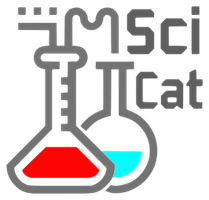

# SciCat Metadata catalogue

## What?

A project to catalogue and provide access to metadata and raw experimental data.

## How?

Scicat is made up of the following technologies:

* Web based frontend - [Catanie](https://github.com/SciCatProject/catanie): An Angular \(2+\) based application that uses ngrx to communicate with the SciCat API and provide a searchable interface for datasets, as well as the option to carry out actions \(i.e. archiving\) and acts as a place to reference datasets used in publications.

* API Server - [Catamel: ](https://github.com/SciCatProject/catamel)A NodeJS application that uses the Loopback framework to generate RESTful APIs from JSON files that define models \(such as: Users, Datasets, Instruments etc\). Follows the Swagger API format and SDKs can be generated in almost any language.

* Database - [MongoDB](https://www.mongodb.com/)

* Data Ingesting - [Node-RED](https://nodered.org/): A NodeJS based visual programming tool to handle flows of data from one source to another.

## Documentation

This repository provides the documentation for each of the services that comprises SciCat, as well as some guides on the user interface and how to perform tasks. This is split into the following sections:

* Devops - Developers and Sysadmins can use this section for instructions on how to deploy, test and develop with SciCat
* Users - Users of the system can come here to see annotated screenshots, FAQs and find resources on how to better understand SciCat.

## Talks

[SciCat Project: Data Catalog System](https://icatproject.org/wp-content/uploads/2017/12/ICAT_F2F_2017_PSI.pdf)

