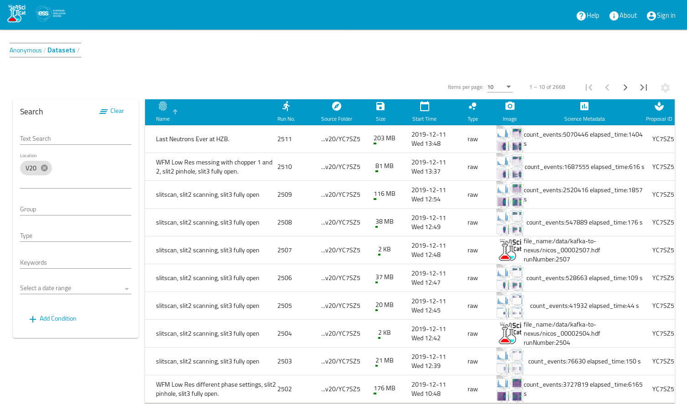

# Anonymous View
As soon as you visit the starting page of the GUI application, and you are not yet logged in, you will see a list of datasets, which have been published, and can therefore be looked at anonymously:

You can filter the datasets by choosing the "facets" on the left navigation section (in the screenshot for the  location field a value of "V20" was selected).

From this list you can choose a particular dataset to see the details of this dataset

