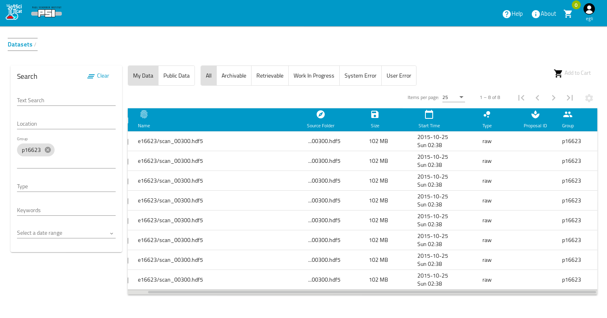
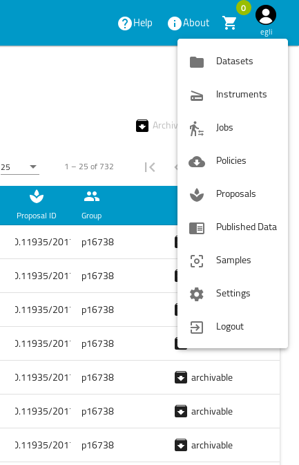
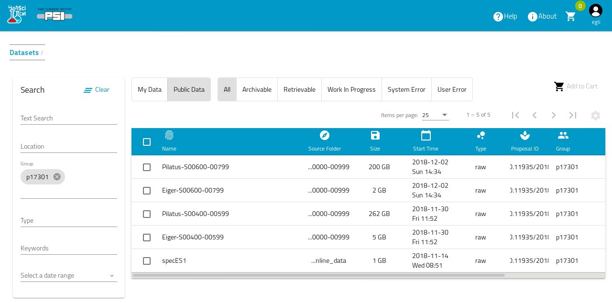

## Dashboard

The dashboard is the first page that you see after being logged in. It contains an overview of all datasets that you have access to.

## Menu access to different information pages

You can always navigate to other parts of the application, simply by clicking on the user icon on the top right corner 

## Filtering Datasets

You can currently filter across 5 different fields:
1. Location (= field creationLocation)
2. Groups (= field ownerGroup)
3. Type (=field type - e.g. raw data or derived data )
4. Keywords  =field keywords, the tags added to the datasets)
5. Start - End Date ( = field createdAt, show datasets captured between the dates that you have set)

The text fields provide an auto completion, which becomes visible as you type. 

One click on the date calendar selects the start date and a second selects the end date. Make sure you select 2 dates.

In the following screenshot the datasets are filterd by the condition ownerGroup="p17301"

## Searching

The text field at the top of the navigation bar allows you to search the metadata for any word contained in the metadata (but not arbitrary substrings). The search starts automatically when to start to type in this textfield, so better type fast ;-) 

## Configure table columns

The cog wheel symbol on the top right allows to define the columns, that you want to see in the table

## View Details

To view a dataset simply click on it in the table and a more detailed view will load (this is covered in the next section)

