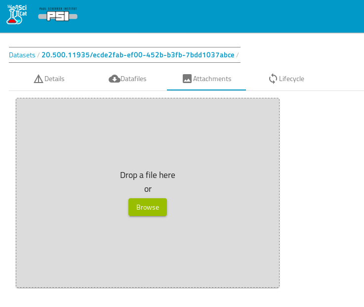

# Dataset Attachments 

[//]: # (TODO new video, just attachment and not more)

[//]: # (This short video demonstrates how you can add an attachment to your dataset easily:may need the following gitbook plugin: https://github.com/GitbookIO/plugin-youtube https://scicatproject.github.io/img/f1-2020-07-14_16.56.44.mp4)

On the dataset details page, you can click on the Attachments tab

Simply follow the instructions to upload an image. The size is restricted to be below 16 MB however

