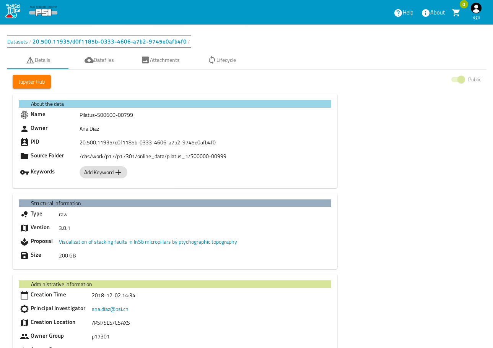

# Dataset Details View

To view a dataset simply click on it in the table in the dashboard and a more detailed view will load

From here you can navigate to the [Datafiles](Dataset_Details_Files.html) File Listing View as well to a view, where you can add image [attachments](Dataset_Attachments.html)

You can also navigate to a Jupyterhub instance, by clicking the orange button at the top of the page. This leads you (if configured) to a Jupyterhub site, where you can login in order to analyze the data in the meta data catalog. This is mainly meant as a way to pursue statistical analysis on the meta data.

E.g. at PSI you will be given a set of predefined Jupyter notebooks, which retrieve the data contained in the data catalog by calling the data catalog interfaces (API server) and then provide pivot tables and graphs of the data, such as accumulated data over time etc. 

