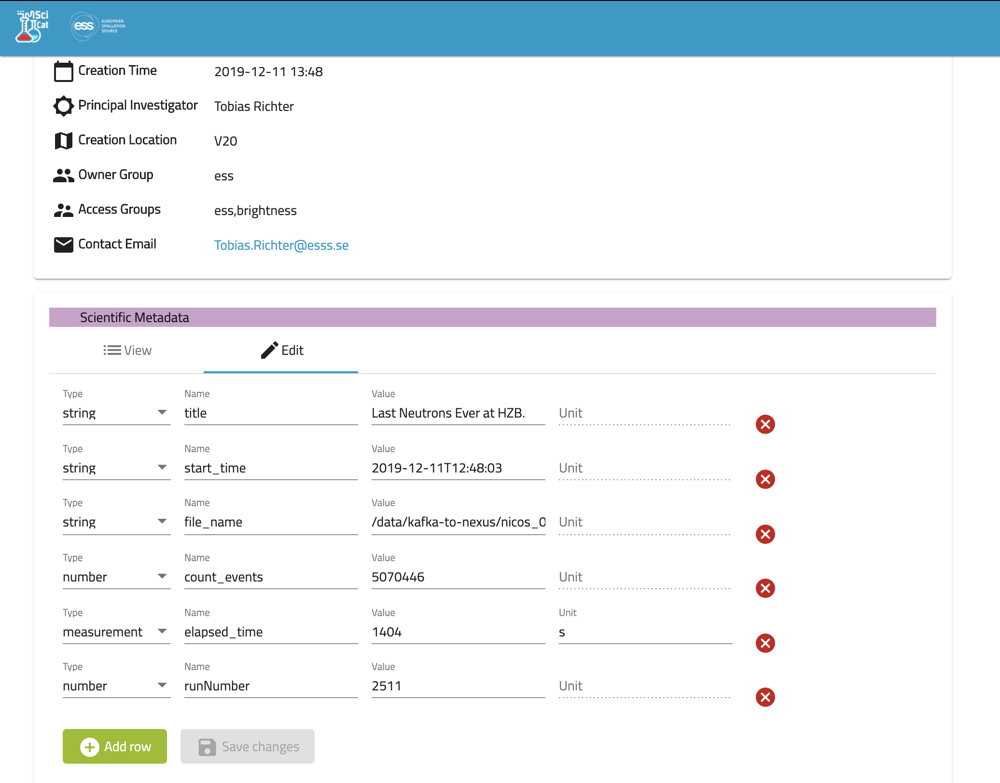

# Edit Scientific Metadata

If enabled, fields in the scientific metadata can be modified and edited by the owner of the data by hitting the "Edit" Icon. The user can add,remove or change metadata fields, every change will create a new record in the databse with it's history.

This [short video](https://scicatproject.github.io/img/editMeta.mp4) demonstrates how you can edit the metadata.