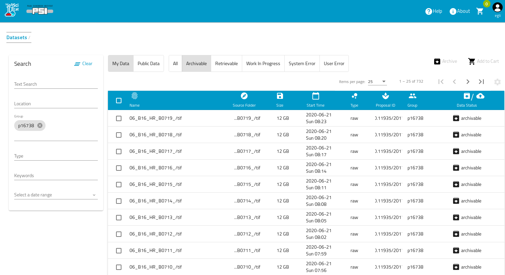
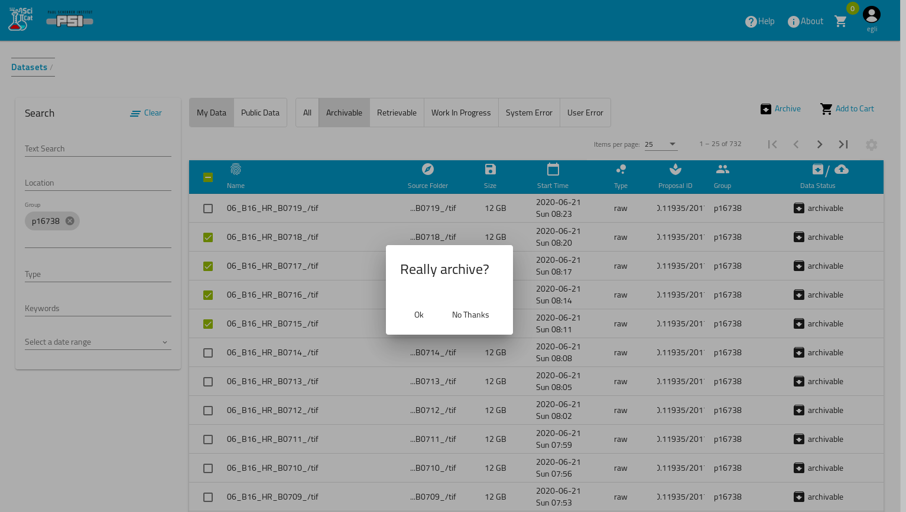
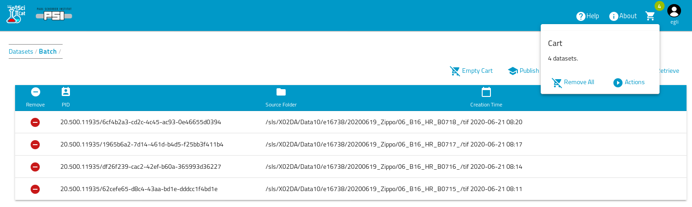
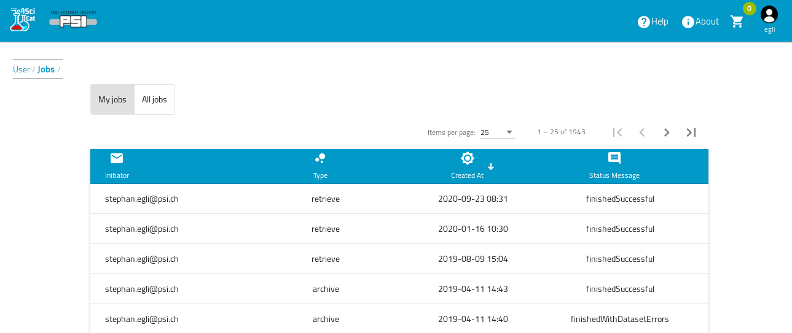
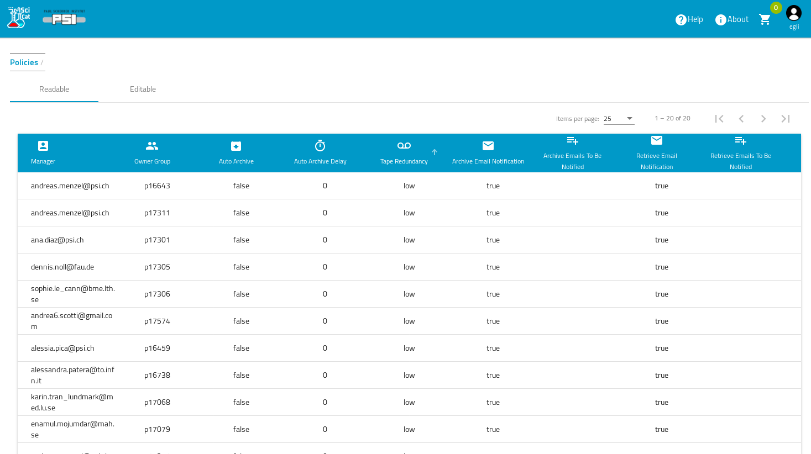
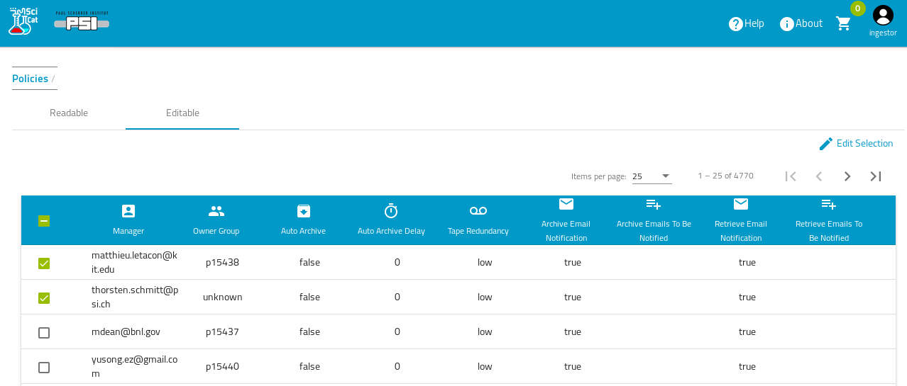
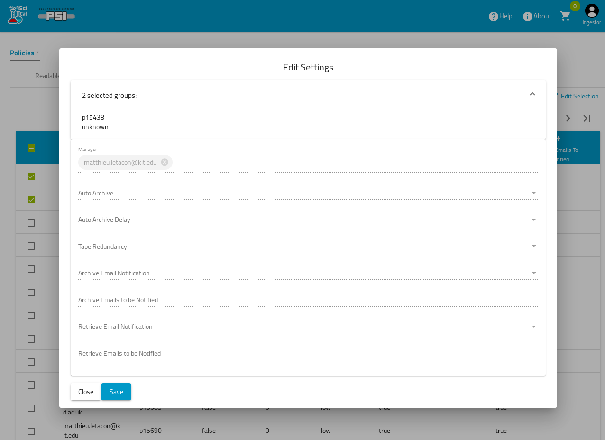

# Archival and Retrieval Jobs 

If enabled by your SciCat operator you can submit Jobs to both archive data to permanent (tape) storage or retrieve it from tere

## Archiving

To start archive jobs you best select datasets, which are in an *archivable* state by using the appropriate radio button on top of the dataset table. The state *archivable* means, that there exist files for this dataset and the dataset has not yet been archived already.

Then you select the datasets you want to have archived and hit the *Archive* button on the top right

After a confirmation dialog a archive job will be submitted, which will take care e.g. of copying the data from disk to tape (status at PSI). It is up to the SciCat operator to define the detail action which will be triggerd by such a Job, see the Operator manual for details

As an alternative way of selecting the files you can first fill the *Cart* with the selected datasets, then go to the Cart to "checkout", and choose the proper action from the list of available actions, which could be archive, retrieve, publish etc

## Retrieval

In the case of dataset *retrieval* you do the same steps, just select Datasets in *retrievable* state and make your selection, then hit the Retrieve button. This will copy the data from tape to an intermediate central storage , from where you can copy the data to the final destination of your choice, using either a command line tool or a GUI or simply an rsync client (this describes the status at PSI, your Site may have decided to do something else)

[//]: # (TODO Add descriptions of CLI and QT tools an of CSCS case)
[//]: # (TODO Add The yED graphs for Archive and Retrieve as illustration)

## Job results

You can check the status of the Jobs submitted in the *Jobs* menu item  , which you can select via the menu dropdown (click on the users icon on the top right, see [dashboard info](Dashboard.html) ). YOu can see both your own Jobs and other peoples jobs

## Policy Configuration for Archiving and Retrieving
You can define for each proposal a default behaviour concerning the treatment of the data in case of archiving and retrieval. The following tables shows the settings for each proposal/pgroup

Multiple of these settings can be edited simultaneously by first selecting the rows

And then editing them:

