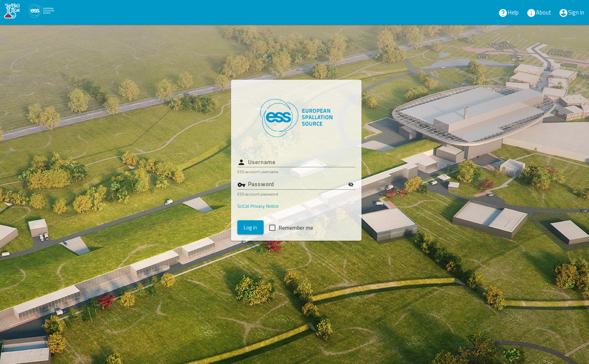
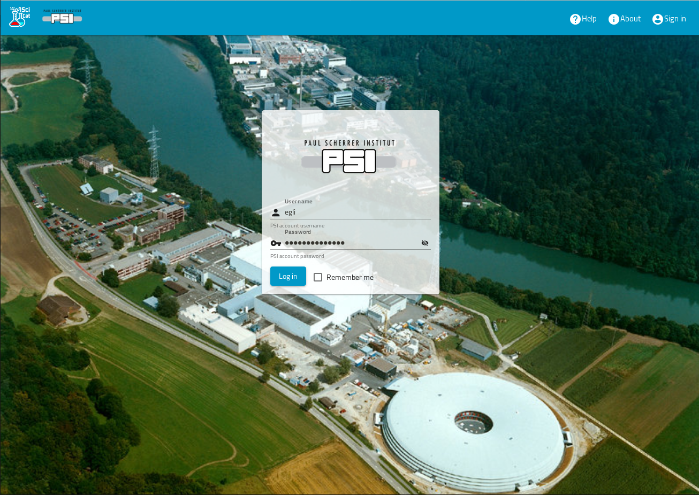

# Login

To get access to **all** the data, for which you have read access, you first have to login. To login hit the "Sign in" Icon at the top right corner.

There are two types of account associated with the DataCatalog: *Functional* and *User*. A *functional* account will primarily be used by software and system administrators to deal with backups and other tasks.

*User* accounts are tied into the login system that is used by your institution, for example: Active Directory. You are able to log in to the system using the same credentials you use on that account. This process is called *authenitication* in IT tech terminology

When you login as a user your user management system will assign groups to the logged in user. Each dataset is also assigned to one such group (via the so called ownerGroup field), and you can view the datasets only, if you are member of the corresponding group. The logic that defines, what parts of the data you can see, is called "authorization" in IT terminology

Another  example login page from PSI is here

