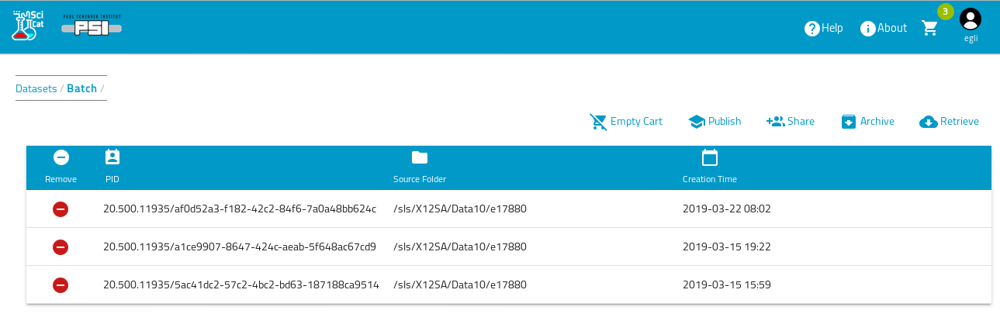
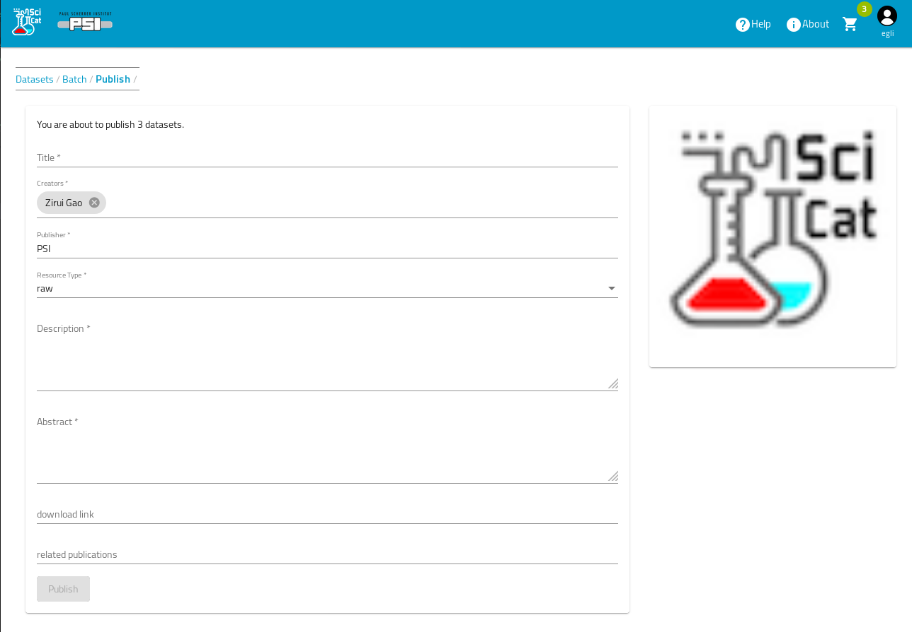
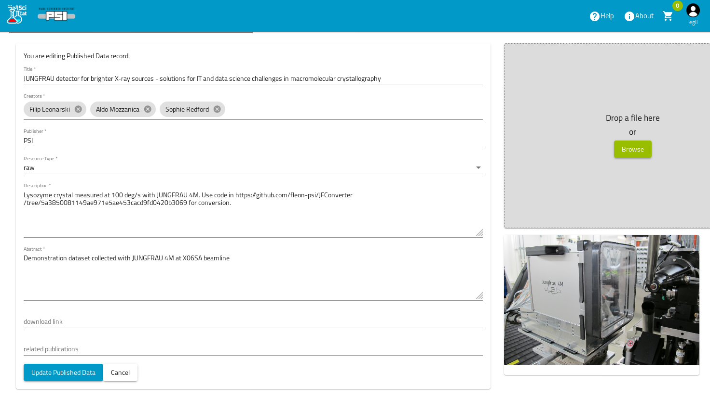
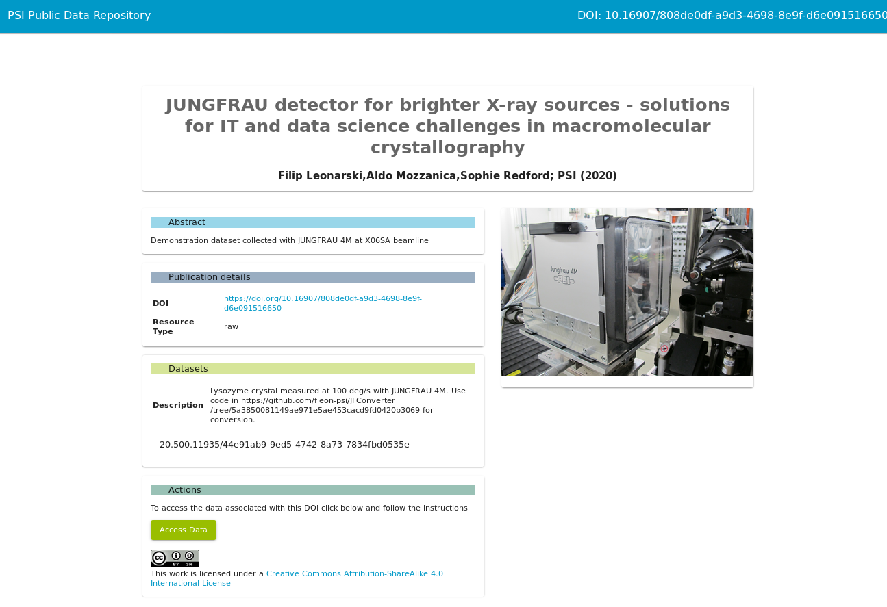
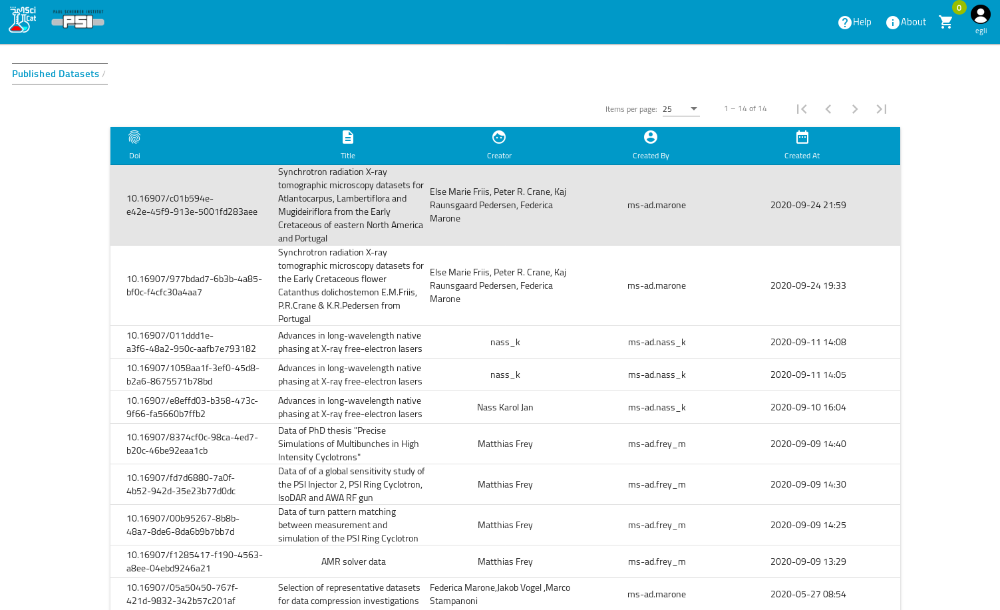

# Publishing the data

Data that is known to the data catalog can be published. The publication workflow does the following:

1. It defines a **set** of datasets to be published
2. It assigns metadata relevant to the publication of the datasets, such as author, abstract etc
3. It assigns a **digital object identifier**  DOI to the published data, which can e.g. be used to link from a journal article to the data
4. It makes the data publicly available by providing a **landing page** that describes the data.
5. It publishes the DOI to the worldwide DOI system , e.g. from Datacite

So the first step is to select the datasets, that should be published

Then by hitting the "Add to Cart" button these datasets are available in the Cart. This step can be repeated to add further datasets. Once the selection is finished you open the Cart ( click on the Cart symbol and choose actions ) to see the selected datasets:

Here you can still change your selection, remove datasets etc. Once this is finished simply hit the publish button. This leads you to the following screen:

Some of these fields will be pre-filled with information derived from the proposal data, such as the abstract. Independent of the pre-filling you can change the contents as you like until you are satisfied. Then hit the publish button, which leads you to the resulting display page:

Initially the status field is in state "pending". This means, the published data information has been stored, but not yet made public to the worldwide DOI system, and no landing page has been created yet. This gives the possibility, that (potentially another person) can have  a look at the data and do further editing by hitting the Edit button:

Once this is finished one can hit the "register" button (not shown in previous screenshot, because already in state registered)to register the DOI and thus making the data public. The resulting public landing page for this data then looks somethink like this

Finally you can have a look at all the published data by going to the Published Data menu item (again by clicking the user icon at the top right corner and choosing "Published Data"):

This [short video](https://scicatproject.github.io/img/attach_and_publish.mp4) demonstrates how you can add an attachment to your dataset and publish the data.